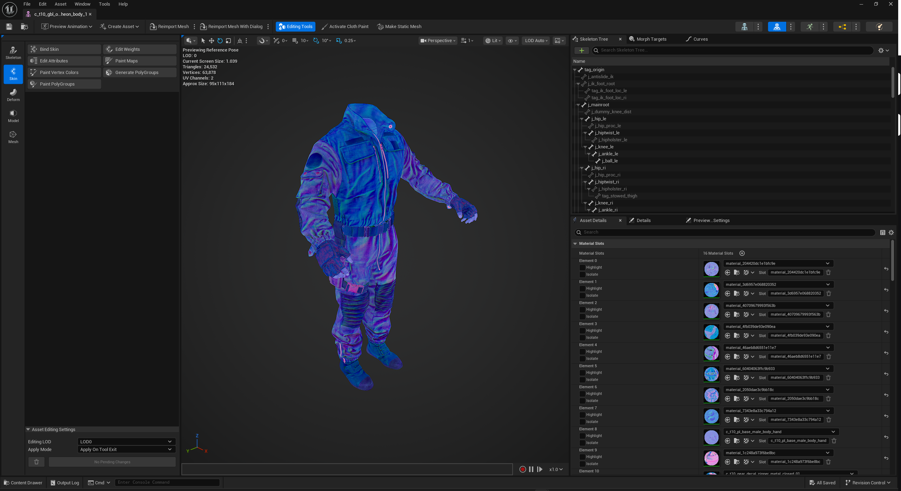
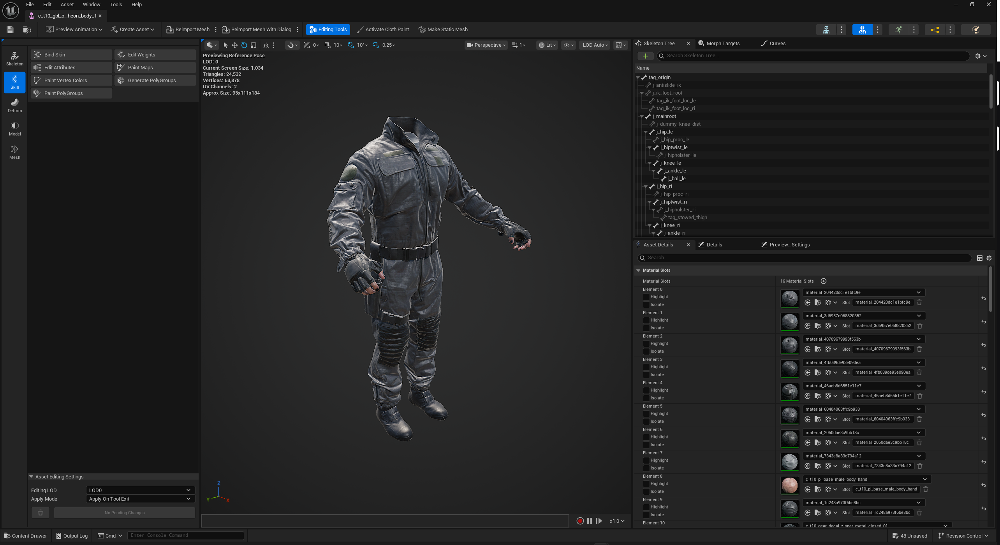

# UECast BO7 Semantic Fix

An Unreal Engine 5.7 editor plugin that repairs broken Black Ops 7 materials after importing Saluki `.cast` models through UECast.

## The problem

BO7 changed its SAT texture-semantic layout. Current exports begin at semantic `0x47` and use a `0x10` stride between material layers, while the affected UECast build interprets the data with the older `0x46` / `0x0F` layout.

Saluki preserves the raw `unk_semantic_XX` values correctly, but UECast binds the corresponding textures to the wrong material parameters. In the common broken layout, the real fused color source is bound to `nogMap`, the packed NOG source is bound to `emissiveMap`, and `colorMap` is left incorrect or empty. The same mismatch can also give textures the wrong sRGB and compression settings.

This plugin repairs already-imported assets without modifying UECast or requiring its source code.

## Preview

| Before | After |
| --- | --- |
|  |  |

## What the plugin does

- Detects the authenticated BO7 displaced-binding signature on selected material instances.
- Reconstructs albedo from the fused color/specular texture.
- Decodes the packed hemi-octahedral normal data from the NOG texture.
- Creates corrected `_bo7_c` and `_bo7_n` texture assets in a `BO7_Fixed` folder.
- Applies correct sRGB and normal-map compression settings.
- Changes repaired instances to C2MAsset's `CoDBase` parent and assigns `colorMap` and `normalMap`.
- Leaves changes unsaved so the result can be inspected or undone before committing it to the project.

The conversion is implemented natively in C++. It does not require Python, NumPy, Pillow, GameImageUtil, or access to the original Saluki export folder.

## Requirements

- Unreal Engine 5.7
- A BO7 model already imported through the affected UECast version
- C2MAsset with `/C2MAsset/Shading/Base/Materials/CoDBase.CoDBase`

## Installation

1. Download `UECastBO7SemanticFix-UE5.7-v1.1.0.zip` from the [latest release](https://github.com/Politohh/UECAST-BO7-FIX/releases/latest).
2. Close Unreal Editor.
3. Extract the `UECastBO7SemanticFix` folder into `<YourProject>/Plugins/` or `<UE_5.7>/Engine/Plugins/Marketplace/`.
4. Start Unreal Editor and enable **UECast BO7 Semantic Fix** if prompted.
5. Restart the editor once after enabling it.

## Usage

1. Select the imported Skeletal Mesh, Static Mesh, or affected Material Instances in the Content Browser.
2. Run **Tools > Analyze Selected BO7 UECast Materials**.
3. Review the read-only analysis result and Output Log.
4. Run **Tools > Repair Selected BO7 UECast Materials**.
5. Inspect the corrected model in the viewport.
6. Save the generated textures and modified material instances only after confirming the result.

The repair is wrapped in an Unreal transaction, so material changes can be undone. Original imported texture assets are never overwritten.

## Safety and scope

- Only explicitly selected assets are considered.
- Analysis never changes assets.
- Repair requires distinct displaced color and packed-NOG texture overrides; unrelated materials are skipped.
- Assets are not saved automatically.
- Generated textures are placed beside their source textures under `BO7_Fixed`.

## Current limitations

- Deep reconstruction currently targets the base material layer.
- The repaired `CoDBase` instance uses reconstructed color and normal maps. Gloss, occlusion, and experimental specular output are not wired automatically.
- A texture UECast did not retain as a material-instance override cannot be recovered from that instance alone.
- This release targets the BO7 semantic shift described above and Unreal Engine 5.7.

## Credits

- [Scobalula](https://github.com/Scobalula) for [Saluki](https://github.com/Scobalula/Saluki) and the original GameImageUtil texture-processing research.
- [Astral](https://github.com/o-Astral-o) for [UECast](https://github.com/o-Astral-o/UECast).

## License

Licensed under the [GNU General Public License v3.0](LICENSE).

For bug reports or material samples that do not repair correctly, open a GitHub issue and include the Unreal Output Log from the analysis pass.
